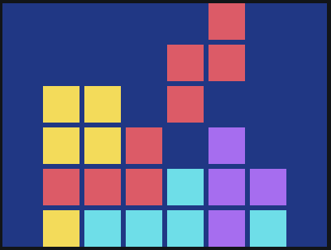

# 💅🏾 Code, But Make it Cute

## 👋🏾 About this Project
Welcome to Code, But Make it Cute! Here you'll find notes and CodePen starter templates that accompany the talk given by [Bree Hall](https://tiktok.com/@bytesofbree) (that's me!) at [BaddieCon](www.baddiesintech.com/baddiecon) during the summer of 2024.

This is a fun beginner friendly presentation on creative coding with HTML and CSS. It’s all about mixing code with creativity, and building for the purpose of fun and enjoyment.

## 🗺 What's Included
This repo contains the code for two HTML & CSS based projects. Final code for each project can be found in the `src/` directory.

### Tetris Pixel Art
Build Tetris inspired pixel art by chaining box shadows to simulate "pixels".

✨ [CodePen Tetris Starter Template](https://codepen.io/breehall/pen/RwzxbLL)

### Building a Gameboy with CSS
Use familiar CSS properties to build and compose a Nintendo Gameboy console.

✨ [CodePen Gameboy Stater Template](https://codepen.io/breehall/pen/mdZqKMp)

## Acknowledgements 
The art used for the Tetris pixel art comes from [CSS Battle #122](https://cssbattle.dev/play/122). This puzzle belongs to the CSS Battle team.

I do not own any rights to the Nintendo Gameboy console. I'm just an engineer who loves video games 🎮

